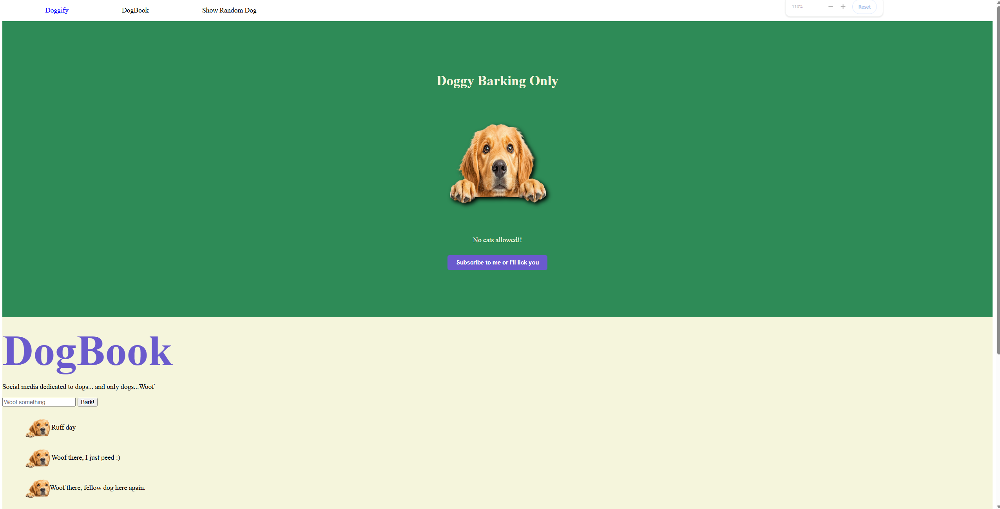

# 🐶 Doggify - A Social Media for Dogs 

A fun, dog-themed webpage where users can:
- Fetch random dog pictures 🖼️
- Post "Woof" messages 📝
- Enjoy a dog-exclusive social feed 🐕



## 🛠️ Technologies Used
- **HTML5** - Page structure
- **CSS3** - Styling
- **JavaScript** - Dynamic features (dog API, post submissions)
- **Dog CEO API** - Random dog images

## 🚀 How to Run
1. **Clone the repository** (or download the files):
   ```bash
   git clone https://github.com/ccarl008/dogBook.git